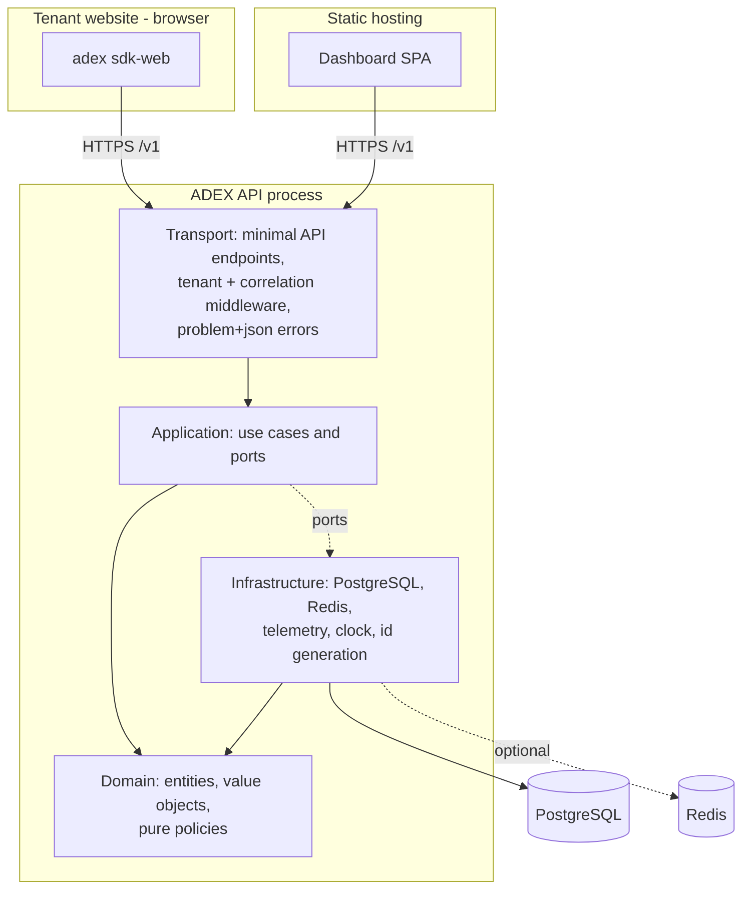

# Container and module view

## Deployable units

| Unit | Technology | Repository path | Deployment |
| --- | --- | --- | --- |
| ADEX API | ASP.NET Core (net10.0) | `src/Adex.Api` | One process, horizontally scalable, stateless |
| Web SDK | TypeScript, zero runtime deps | `packages/sdk-web` | Published package / static bundle loaded by tenant sites |
| Dashboard | TypeScript + Vite + React | `apps/dashboard` | Static assets; talks only to the public API |
| PostgreSQL | 17 | `docker-compose.yml`, `infra/` | Managed service in real environments |
| Redis | 7.4 | `docker-compose.yml`, `infra/` | Optional; service degrades without it |
| Simulator | Python 3.12 | `simulation/adex-simulator` | Developer/CI tool, never deployed to serve traffic |

## .NET project boundaries

Dependencies point inwards. The compiler enforces this through project
references; nothing else is permitted to.

| Project | May reference | Must not reference |
| --- | --- | --- |
| `Adex.Domain` | nothing (BCL only) | ASP.NET Core, Npgsql, Redis, configuration, logging abstractions with I/O |
| `Adex.Application` | `Adex.Domain` | any concrete database, cache, HTTP or telemetry library |
| `Adex.Infrastructure` | `Adex.Application`, `Adex.Domain` | `Adex.Api` |
| `Adex.Api` | all of the above | — (it is the composition root) |

`Adex.Domain` has no NuGet dependency at all. That is a deliberate, checkable
property: if a pull request adds one, the reviewer asks why.

## Modules inside the monolith

Modules are the extraction seams described in ADR-0001. Each owns its use cases,
its tables and its public contract surface.

| Module | Owns | Public surface |
| --- | --- | --- |
| `Tenancy` | tenants, API keys, allowed origins, configuration versions | dashboard endpoints |
| `Decisioning` | placements, alternatives, policies, decisions, propensities | `POST /v1/decisions` |
| `Ingestion` | events, deduplication, validation | `POST /v1/events` |
| `Attribution` | event→reward mapping, attribution windows, reward records | internal port + configuration endpoints |
| `Analytics` | aggregates and reporting queries | dashboard endpoints |

Rules:

- A module calls another module only through an application-layer port, never by
  reaching into its internals or its tables.
- A module's tables are not written by another module.
- `Decisioning` must remain independently deployable in principle: it is the
  latency-critical path and the most likely first extraction.

## Request paths

**Decision (synchronous, latency-critical).**

`SDK → POST /v1/decisions → correlation + tenant middleware → validation →
resolve placement configuration (cache, fallback database) → load policy and
state → pure selection in Domain → persist decision (audit) → respond`

Target: the response is produced from in-process computation plus one cache read
and one durable write. No cross-service call, no queue.

**Ingestion (write-heavy, tolerant).**

`SDK → POST /v1/events → validation → deduplicate on (tenant_id, event_id) →
insert event and update reward counters in one transaction → 202`

**Analytics (read-heavy, tolerant).**

`Dashboard → GET /v1/... → tenant-scoped aggregate query on PostgreSQL`

## Foundation status of each container

This is the honest state after task 001; nothing below is implied to be more
complete than it is.

| Container | Status after task 001 |
| --- | --- |
| `Adex.Domain` | Real: identifiers, decision/event primitives, pure policy abstraction and `uniform-random` implementation, unit-tested. |
| `Adex.Application` | Real ports and two use cases (request decision, record event) wired to a development store. |
| `Adex.Infrastructure` | Real health probes for PostgreSQL and Redis; **development-only in-memory stores**, explicitly named as such. No PostgreSQL persistence adapter yet. |
| `Adex.Api` | Real: health endpoints, `/v1/decisions`, `/v1/events`, tenant + correlation middleware, problem+json errors, OpenTelemetry wiring. |
| `packages/sdk-web` | Real client for the two endpoints, with degradation fallback. No storage/consent layer yet. |
| `apps/dashboard` | Shell only: renders API health, no configuration or analytics screens. |
| `simulation/adex-simulator` | Real seeded synthetic environment and reproducibility test. No policy evaluation harness yet. |
| PostgreSQL schema | Bootstrap migration only (schema + migration ledger). Entity tables land with the first vertical slice. |

The persistence gap is the single most important thing the next agent closes;
see `docs/planning/foundation-roadmap.md`.
