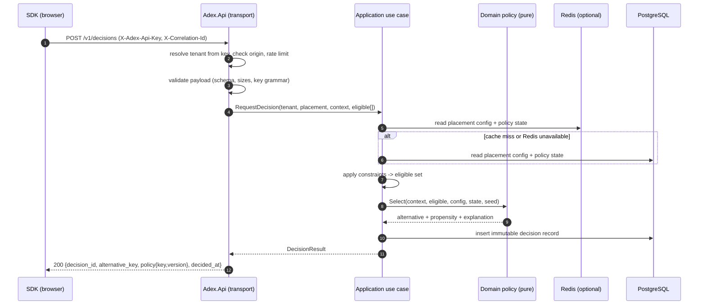

# Decision lifecycle

A decision is the product's central artefact. This document defines exactly what
happens between a client asking and ADEX answering, and what must be true
afterwards.

This is the production-capable target lifecycle. In the task-003 executable
foundation, API-key tenant resolution, strict validation, tenant-specific
context allow-lists, decision idempotency, pure selection and the in-memory
development audit store are implemented. Origin enforcement, placement
configuration/not-found semantics, rate limiting, Redis read-through and
PostgreSQL persistence remain roadmap work and are therefore not advertised as
current responses in the v1 OpenAPI contract.

## Sequence



## Stages

**1. Authenticate and scope.** The publishable API key resolves to exactly one
tenant. The `Origin` header must match the tenant's allow-list. Failure is
`401` (unknown/invalid key) or `403` (origin not allowed). The tenant is bound
to the request context and is a required argument to every downstream call — it
is never ambient state (ADR-0007).

**2. Validate.** Payload size, JSON shape, key grammar, context allow-list,
eligible-alternative membership, timestamp format. Unknown context keys and
unknown alternative keys are validation errors (`422`), not silent filters — a
tenant must find out that their configuration and their page disagree.

**3. Resolve configuration.** Placement, its bound policy and policy version,
its constraints, and the tenant's configured alternatives. Read-through Redis
cache with a short TTL; on cache miss or Redis failure, PostgreSQL answers and
the request continues (ADR-0004). Unknown placement is `404`.

**4. Apply constraints.** Constraints filter the eligible set before the policy
runs. The removed keys and the reason are recorded on the decision. If the
eligible set becomes empty, ADEX returns `409` with a machine-readable
`no_eligible_alternatives` problem type — it never invents an alternative.

**5. Select.** A pure domain function:

```text
Select(context, eligibleAlternatives, policyConfiguration, policyState, seed)
  -> (selectedKey, propensity, explanation)
```

No I/O, no clock read, no ambient randomness: the seed is passed in. This is
what makes selection unit-testable and replayable.

**6. Persist the audit record.** One immutable row containing: `decision_id`,
tenant, placement, policy key and version, requested eligible set, constrained
eligible set, selected key, propensity, context snapshot, policy state snapshot
reference, seed, `decided_at` (UTC), correlation id, and SDK version. Written
before the response is returned — an unlogged decision is worse than a failed
one, because rewards would later attach to nothing.

**7. Respond.** Minimal body by contract (ADR-0006). `X-Correlation-Id` is
echoed on the response.

## Determinism and replay

The seed is derived as
`seed = HMAC(decision_seed_salt, tenant_id || placement || policy_version || (subject_id ?? decision_id))`.

Consequences:

- The same subject at the same placement under the same policy version gets a
  *stable* assignment, which is what makes an A/B split sticky across page views.
- Given a stored decision row, the selection can be recomputed offline and
  compared to what was served. This replay check is the acceptance test for
  every policy.
- Rotating the seed salt deliberately reshuffles assignments; it is an operator
  action with a documented consequence, not a routine one.

## Propensity

Every decision stores the probability with which the selected alternative would
have been chosen under the acting policy. For `uniform-random` it is `1/n`; for
`ab-split` it is the configured weight; for `thompson-sampling` it is estimated
by sampling. Propensities are recorded from stage 2 of the policy roadmap
onwards because off-policy evaluation cannot be added to unlogged history
(ADR-0009).

## Failure behaviour

| Situation | HTTP | Behaviour |
| --- | --- | --- |
| Unknown or malformed API key | 401 | `problem+json`, no tenant leak |
| Origin not in tenant allow-list | 403 | Logged as a security event |
| Unknown placement | 404 | Never reveals whether another tenant has it |
| Invalid payload / unknown context key / unknown alternative | 422 | Field-level `errors[]` |
| No eligible alternatives after constraints | 409 | `no_eligible_alternatives` |
| Rate limit exceeded | 429 | `Retry-After` |
| Redis unavailable | 200 | Serve from PostgreSQL; increment `adex.cache.degraded` |
| PostgreSQL unavailable | 503 | Fail closed; the SDK falls back to its client-side default |
| Policy evaluation throws | 503 | Never serve an unlogged decision |

**Client-side degradation.** If the SDK gets no usable answer within its timeout
(default 800 ms) it renders the first eligible alternative, marks the impression
as `fallback`, and does not emit a decision-linked event. A slow ADEX must never
mean a blank region on a tenant's page.

## Latency budget (initial target, to be validated by measurement)

| Segment | Budget (p95) |
| --- | --- |
| Transport, auth, validation | 5 ms |
| Configuration and policy state read (cache hit) | 5 ms |
| Selection (pure) | 1 ms |
| Decision persistence | 15 ms |
| Server total | 30 ms |
| SDK-observed total (regional network) | 150 ms |

These are targets, not measurements. The load baseline that validates or
corrects them is a roadmap item.
