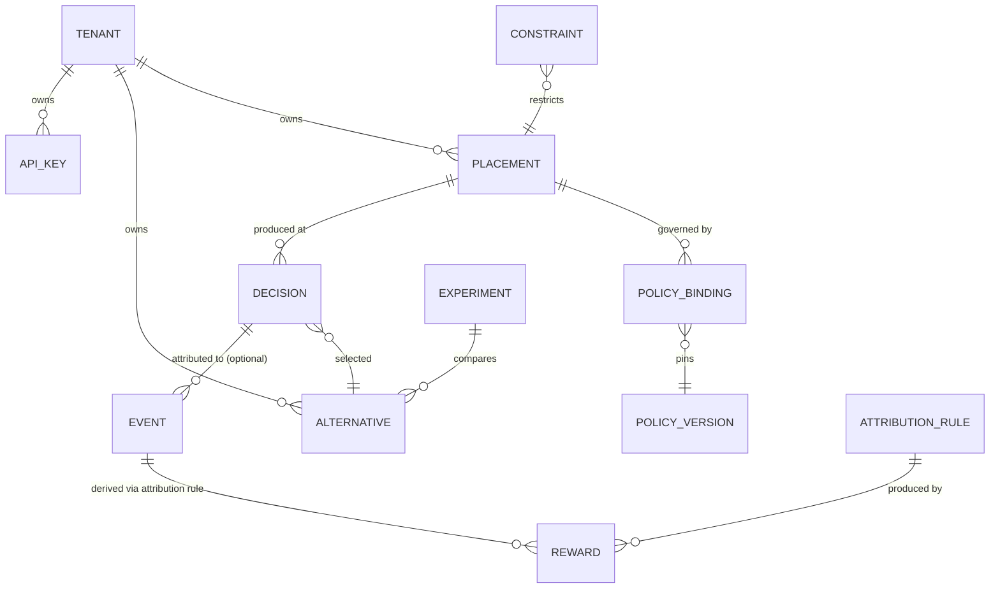

# Domain model

The vocabulary below is fixed by `AGENTS.md` invariant 1. Nothing in this model
may acquire industry-specific meaning; industry meaning belongs to tenant
configuration data.

## Concepts

**Tenant** — an isolated customer of ADEX. Owns everything else. Identified by
`ten_<ulid>`. Every query, row and credential is scoped to exactly one tenant.

**Placement** — a named decision point on a tenant's surface, for example
`homepage.primary-cta`. Stable, human-authored, tenant-unique. A placement
declares which context keys it accepts and which policy governs it.

**Alternative** — one option that may be selected at a placement, identified by
a tenant-unique `key` (`variant-a`). The presentation payload for an alternative
is tenant configuration; the core stores it as opaque JSON and never interprets
it.

**Context** — an allow-listed map of low-cardinality, non-identifying signals
describing the situation of a decision (`device_class`, `referrer_group`,
`locale`, `page_group`, `session_ordinal`). Context is an input to policies and
is stored with the decision so the decision can be replayed.

**Subject** — the anonymous entity a decision is about, identified by
`anon_<ulid>`, optional, tenant-scoped, rotatable (ADR-0008). Not a person, not
a user account.

**Policy** — a versioned selection strategy: `deterministic-rules`,
`uniform-random`/`ab-split`, `thompson-sampling`, then contextual methods
(ADR-0009). A policy is a pure function of context, eligible alternatives,
configuration, a state snapshot, and a random draw.

**Policy version** — an immutable integer identifying a policy's configuration.
Changing configuration mints a new version; learned state never crosses versions.

**Decision** — the immutable record of one selection. Contains `decision_id`,
tenant, placement, policy key and version, the eligible alternative set, the
selected alternative, the propensity of that selection, the context snapshot,
the policy state snapshot reference, the seed, and `decided_at` (UTC). A
decision is an audit record: it is written once and never updated.

**Event** — a behavioural signal reported later: `impression`, `click`,
`lead`, `purchase`, or a tenant-defined type. Carries `event_id` (client
generated, the deduplication key), an optional `decision_id`, `occurred_at`
(client clock, untrusted) and `received_at` (server clock).

**Reward** — the numeric consequence derived from events by an attribution rule.
For the first policies this is Bernoulli (0/1). Rewards are derived data with an
explicit link to the event and rule version that produced them.

**Attribution** — the versioned, configurable rule mapping events to rewards for
an objective: which event type counts, within which window after the decision,
with what value, and what happens when several decisions could claim the same
event (default: last touch within the window, at most one reward per objective
per decision).

**Experiment** — a bounded comparison over a placement: a set of alternatives, a
policy, a start and end, and a success objective. An experiment is a
configuration wrapper; it does not introduce a second decision mechanism.

**Constraint** — a rule restricting which alternatives are eligible in a given
context (for example a schedule, a capacity limit, or a mutual exclusion).
Constraints filter the eligible set *before* the policy sees it, so a policy
never has to know why an alternative was excluded — and the exclusion is
recorded with the decision.

## Relationships

## Invariants

1. Every entity above is tenant-owned; there is no global object other than the
   tenant registry itself.
2. A decision is immutable. Corrections are new records, never updates.
3. A decision must be replayable: its stored inputs plus its seed must reproduce
   its selected alternative for the same policy version.
4. `(tenant_id, event_id)` is unique. Duplicate ingestion is a no-op that
   reports `duplicate` (ADR-0012).
5. An event may only be attributed to a decision of the same tenant.
6. A reward always names the attribution rule version that produced it.
7. Policy state is scoped to `(tenant, placement, alternative, policy version)`.
8. All timestamps are stored in UTC; client-supplied times are stored alongside
   server-received times and never overwrite them.
9. Eligible alternatives are supplied per request but must be a subset of the
   tenant's configured alternatives for that placement; unknown keys are a
   validation error, not a silent filter.

## Value objects and identifiers

| Concept | Public form | Notes |
| --- | --- | --- |
| Tenant | `ten_01J...` | 26-char Crockford base32 ULID after the prefix |
| Decision | `dec_01J...` | Server-generated, monotonic within a millisecond |
| Event | `evt_01J...` | Client-generated; validated for format, uniqueness enforced by the database |
| Subject | `anon_01J...` | Client-generated, optional, rotatable |
| Placement key | `[a-z0-9]([a-z0-9._-]{0,62}[a-z0-9])?` | Tenant-unique, human-authored |
| Alternative key | same grammar as placement key | Tenant-unique within a placement |

Identifiers are opaque to clients. Internal surrogate keys are never exposed
through the public API (ADR-0006).

## Deliberately absent

Segments, audiences, user profiles, funnels, budgets, creatives, and pricing are
*not* domain concepts here. Each is either tenant configuration expressed with
the concepts above, or a product feature that would need its own ADR before it
earns core vocabulary.
