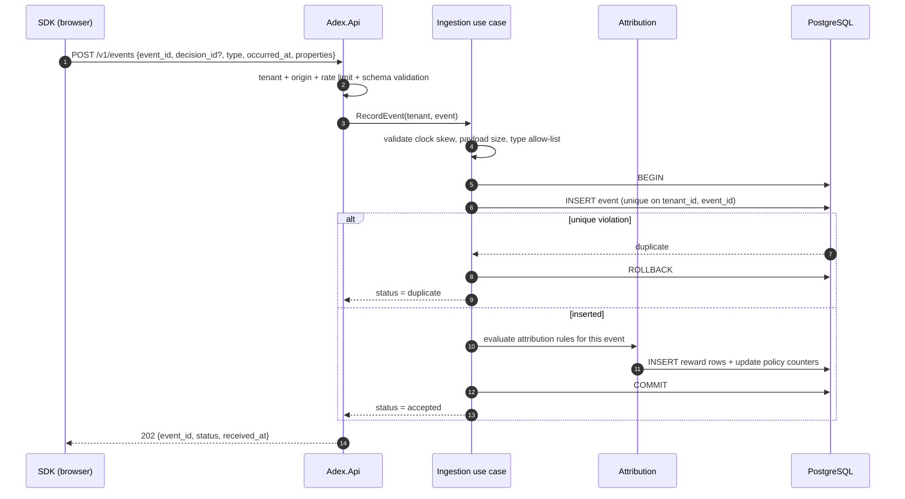

# Event and reward lifecycle

Decisions are only useful if what happens afterwards can be measured. This
document defines how a behavioural signal becomes a reward that a policy can
learn from, and which guarantees hold at each step.

## Sequence

## Guarantees

**At-least-once delivery, exactly-once effect.** The SDK may retry freely; the
composite unique constraint on `(tenant_id, event_id)` makes a replay a no-op.
Because reward writes happen in the *same transaction* as the event insert,
there is no window in which an event is stored but its reward is not, and no
path by which a duplicate increments a counter (ADR-0012).

**Client clocks are untrusted.** `occurred_at` is stored as reported and used
only where client time is explicitly requested. `received_at` is the server
clock and is what ordering, windows and analytics use by default. Events more
than 5 minutes in the future or 7 days in the past are rejected with `422`.

**Events without a decision are valid.** Site-wide signals (a purchase that no
placement claimed) are ingested with `decision_id: null`. They are still useful
as denominators and as inputs to future contextual policies; they simply produce
no reward for any decision unless an attribution rule claims them.

**Nothing is ever mutated.** Events and rewards are append-only. A corrected
attribution is a new reward row under a new rule version, never an update.

## Attribution

An attribution rule is tenant configuration with an explicit version. It
answers four questions:

1. **Which objective** does it serve (`lead`, `purchase`, a tenant-defined one)?
2. **Which event types** count toward it?
3. **Within what window** after the decision (default 7 days, per-objective
   configurable)?
4. **How is the reward valued** — Bernoulli `1` for the first policies; scalar
   value fields are contract-ready but not consumed by any shipped policy yet.

**Claiming rule.** When several decisions could claim one event, the default is
*last touch inside the window*: the most recent decision for the same
`(tenant, subject, placement, objective)` whose `decided_at` precedes the event
and falls inside the window. At most one reward per `(decision, objective)`. The
rule is configurable per tenant, and every reward row records which rule
version produced it, so a re-analysis under a different rule is a new
computation rather than a rewrite of history.

**Late events.** An event that arrives after its window closed is stored and
marked unattributed. It appears in data-quality metrics; it does not silently
change a converged policy.

## Reward to policy state

For Bernoulli objectives the policy state per
`(tenant, placement, alternative, policy_version)` is a pair of counters
`(successes, failures)`, updated when a decision's outcome is resolved:

- reward attributed → `successes += 1`
- window closed with no attributed reward → `failures += 1`

The second half matters and is easy to forget: a bandit that only ever hears
about successes will believe everything works. Window closure is therefore an
explicit scheduled step, not a side effect of traffic.

Counters live in PostgreSQL. Redis may cache them for read; a cache miss reads
through, and a Redis outage changes latency, never the learned values
(ADR-0004).

## Data quality signals

The following are first-class metrics, because silent degradation here corrupts
learning:

| Signal | Meaning |
| --- | --- |
| `events.duplicate_ratio` | Retry storms, buggy integrations |
| `events.unmatched_decision_ratio` | Events citing an unknown or foreign `decision_id` |
| `events.clock_skew_rejected` | Clients with badly wrong clocks |
| `events.late_beyond_window` | Attribution windows possibly too short |
| `decisions.without_impression_ratio` | Decisions the page never rendered |
| `rewards.per_rule_version` | Effect of an attribution configuration change |

## Retention

Raw events default to 400 days; derived aggregates and policy counters outlive
them. Deletion by `subject_id` must exist before a production tenant onboards
(ADR-0008); it is a roadmap item, not an assumed capability.

## Foundation status

Task 001 implements the contract, the validation semantics, the duplicate
response semantics, and a development in-memory store. Durable persistence,
attribution rules, window closure and counters are the first vertical slice and
the policy task — see `docs/planning/foundation-roadmap.md`. Nothing in this
document should be read as "already running in production".
