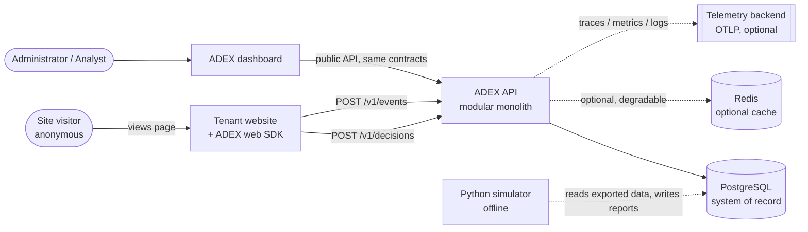

# System context

## What ADEX is

ADEX is an installable decision and experimentation layer for websites and web
applications. A client site asks ADEX *what to show* at a named place on a page;
ADEX answers with one of the alternatives the client declared eligible, records
why it answered that way, receives the behavioural events that follow, and turns
those events into rewards that improve later answers.

ADEX is domain-neutral by construction. It knows about tenants, placements,
context, alternatives, policies, decisions, events, rewards, experiments,
constraints and attribution. It knows nothing about any particular industry;
industry meaning lives entirely in a tenant's configuration.

## Actors and external systems

| Actor | Interacts with | Purpose |
| --- | --- | --- |
| Site visitor (anonymous) | Tenant website running the ADEX SDK | Sees a selected alternative; produces behavioural events. Never authenticates to ADEX. |
| Integrating developer | `packages/sdk-web`, public API docs | Installs the SDK, declares placements and alternatives, emits events. |
| Business administrator | Dashboard | Configures tenants, placements, alternatives, objectives, constraints, reward mapping. |
| Analyst | Dashboard, analytics API | Reviews conversion, uncertainty, exploration/exploitation balance, policy performance. |
| Operator | Health endpoints, telemetry backend, runbooks | Watches latency, failures, data quality; audits individual decisions. |
| Research agent | `simulation/adex-simulator` | Runs offline simulation and evaluation; never touches the online path. |
| Telemetry backend (external) | OTLP endpoint | Receives traces, metrics and logs. Optional; absence must not break the service. |

## Context diagram

The dashed edges are the degradable ones: Redis, the telemetry backend and the
simulator can all be absent while ADEX keeps serving decisions and ingesting
events.

## Boundaries that must not move

1. **The browser is untrusted.** The SDK is an integration layer. It never
   decides. Every value it sends is validated at the API boundary.
2. **The online path is C#.** No Python process participates in answering a
   decision request (ADR-0003).
3. **PostgreSQL is the only system of record.** Anything that exists only in
   Redis is expendable (ADR-0004).
4. **The core carries no vertical vocabulary.** A reference tenant in any
   industry must be expressible as configuration, with zero source changes.

## What is explicitly outside the system

- Consent management and cookie banners — the tenant's responsibility; ADEX
  exposes a mode that stores nothing.
- Content management and rendering — ADEX returns which alternative, not the
  markup pipeline that renders it.
- Identity and CRM systems — ADEX never requires a login or personal data.
- Cross-tenant learning — a non-goal for the first release.

## Reference tenants

Two unrelated reference tenants are carried through the contracts, examples and
tests, precisely to keep the core honest:

- `ten_ref_services` — a local professional-services site optimizing which call
  to action appears on its home page.
- `ten_ref_catalog` — an online catalog optimizing the ordering of a
  recommendation slot.

If a change makes sense for one and not the other, it belongs in tenant
configuration, not in the core.
