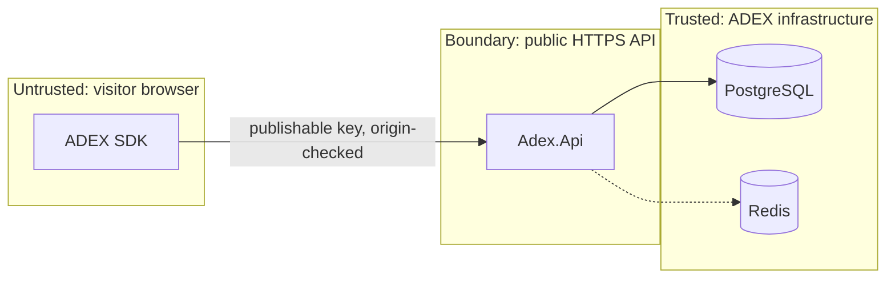

# Initial threat model

Scope: the public browser-facing surface (`POST /v1/decisions`,
`POST /v1/events`), the publishable API key model, the SDK, and the local
development infrastructure. Out of scope for this iteration: the dashboard
authentication design, production network topology, and backup/restore, all of
which are tracked in `docs/planning/foundation-roadmap.md`.

Method: STRIDE over the trust boundaries, plus abuse cases specific to an
adaptive decision system.

## Assets

| Asset | Why it matters |
| --- | --- |
| Decision audit trail | The product's evidence base; corruption is undetectable after the fact |
| Policy state (posteriors, counters) | Poisoned state silently degrades every future decision |
| Tenant configuration | Controls what visitors see on a third-party site |
| Publishable API keys | Public by nature; must be low-value on their own |
| Secret API keys / dashboard credentials | Full tenant control |
| Subject identifiers | Pseudonymous; linkage risk if combined with tenant data |
| Privacy salt | Enables re-identification of tenant-supplied identifiers if leaked |

## Trust boundaries

Everything left of `Adex.Api` is attacker-controlled. The SDK's honesty is not a
security control.

## Threats and controls

### T1 — Spoofing: stolen publishable key used from another site

*Impact:* fake traffic in a tenant's data; skewed policy learning.

*Controls:* key is bound to an origin allow-list, enforced against the `Origin`
header; per-key rate limits; anomaly metrics per origin. **Accepted residual
risk:** `Origin` can be forged by a non-browser client. The publishable key is
therefore treated as public and low-value — it can only request decisions and
emit events, never read data. Data poisoning is mitigated by rate limits,
per-key quotas and data-quality metrics, not by secrecy. *Status: origin
allow-list and rate limiting are specified; implementation lands with the
tenancy module.*

### T2 — Tampering: forged events to bias a policy

*Impact:* an attacker inflates one alternative's reward and forces ADEX to serve
it (or degrades a competitor's variant).

*Controls:* rewards attach only to events citing a `decision_id` that exists,
belongs to the same tenant, and is inside the attribution window; one reward per
`(decision, objective)`; per-key and per-subject rate limits; duplicate
detection (ADR-0012); minimum-exploration floor so a poisoned posterior cannot
fully starve alternatives; data-quality alerts on conversion-rate step changes.
**Residual risk:** a determined attacker with a valid publishable key can still
inject plausible events at a low rate. Accepted for now, mitigated by detection
rather than prevention; signed decision tokens are the planned hardening (see
"Planned hardening" below).

### T3 — Repudiation: "ADEX showed the wrong thing"

*Controls:* immutable decision records with correlation ids, seed, policy
version and the eligible set; replayability; append-only rewards naming their
rule version.

### T4 — Information disclosure: cross-tenant leakage

*Controls:* ADR-0007 in full — explicit tenant argument, composite keys, RLS
backstop, `404` instead of `403` for foreign objects, and a required isolation
test suite. Error responses never echo internal identifiers or SQL.

### T5 — Information disclosure: personal data collected by accident

*Controls:* context allow-list enforced at the contract boundary; undeclared
keys rejected with `422`; no verbatim user agent, no fingerprinting, no raw IP
persistence; tenant-supplied identifiers stored only as salted HMACs (ADR-0008).
**Residual risk:** a tenant can place personal data into an allowed context
value (for example an email address in `page_group`). Mitigation: documented
prohibition, value-length and character limits, and a planned detection scan.

### T6 — Denial of service: ingestion flood

*Controls:* payload size caps, per-key and per-IP rate limits with `429` +
`Retry-After`, request timeouts, connection-pool limits, bounded JSON depth. The
decision path degrades to serving from cache; the SDK degrades to its client-side
default so a tenant's page never blocks. *Status: caps and timeouts specified;
rate limiting lands with the tenancy module.*

### T7 — Denial of service: expensive request shapes

*Controls:* bounded `eligible_alternatives` count (≤ 50), bounded context key
count (≤ 32) and value length (≤ 256), bounded `properties` size (≤ 4 KB),
rejection of deeply nested JSON. Enforced at the contract and validated at the
boundary.

### T8 — Elevation of privilege: tenant-supplied executable logic

*Controls:* configuration is declarative data only. No expression evaluation, no
template execution, no regular expressions supplied by tenants in the request
path (`AGENTS.md`; `PROJECT_BRIEF.md` non-goal). Alternative payloads are opaque
JSON returned to the tenant's own page; ADEX never evaluates them.

### T9 — Cross-site scripting through alternative payloads

*Impact:* a compromised tenant account or a malicious payload turns ADEX into an
XSS delivery channel on the tenant's own site.

*Controls:* the SDK never uses `innerHTML` with server-provided content by
default; payloads are data that the tenant's own code applies; documented
guidance that HTML-injecting integrations are the tenant's responsibility;
Content-Security-Policy guidance in the integration docs.

### T10 — Supply chain

*Controls:* pinned versions with a committed lockfile; `pnpm audit`,
`dotnet list package --vulnerable`, `pip-audit` in CI; zero runtime dependencies
in the SDK; NuGet package source mapping so a package cannot be resolved from an
unexpected feed.

### T11 — Secret exposure

*Controls:* `.env` is git-ignored, `.env.example` carries only obviously fake
local values, secret scanning (Gitleaks) runs in CI on every push and pull
request, and no credential appears in `docker-compose.yml` other than through
environment substitution with a local default.

### T12 — Local development infrastructure exposed

*Controls:* compose binds PostgreSQL and Redis to `127.0.0.1` on non-default
ports; default credentials are explicitly labelled local-only; no volume mounts
outside the repository; the compose file is documented as development-only and
is not a deployment artefact.

## Abuse cases specific to adaptive decisioning

| Abuse case | Response |
| --- | --- |
| Competitor drives fake conversions to one variant | Rate limits, exploration floor, step-change alerting, replayable audit |
| Tenant self-deals by rewarding a variant they prefer | Their own data, their own consequence; documented, plus versioned attribution rules so the change is visible |
| Policy converges on a variant that harms the visitor | Constraints and guardrail objectives; a policy may not be the only safety mechanism |
| Synthetic simulator results presented as commercial proof | Prohibited by `AGENTS.md` invariant 10; simulator output is labelled synthetic in the artefacts themselves |

## Planned hardening (not implemented)

1. **Signed decision tokens.** Return an HMAC over `(decision_id, tenant,
   placement, decided_at)`; require it when an event cites a `decision_id`. This
   turns T2 from detection into prevention. Needs a key rotation design.
2. **Per-subject and per-origin quotas** with automatic throttling on anomaly.
3. **Deletion by subject identifier** (ADR-0008 obligation).
4. **Dashboard authentication and authorization design**, including secret key
   rotation and least-privilege roles.
5. **Backup and restore rehearsal** for PostgreSQL, with a measured RPO/RTO.

## Verification status

Nothing in this document has been penetration-tested. The controls marked
*specified* exist as design and contract constraints; the controls marked
*implemented* are exercised by tests in this repository. The security review
agent (agent 7 in `MULTI_AGENT_ORCHESTRATION.md`) owns turning the rest into
tests.
